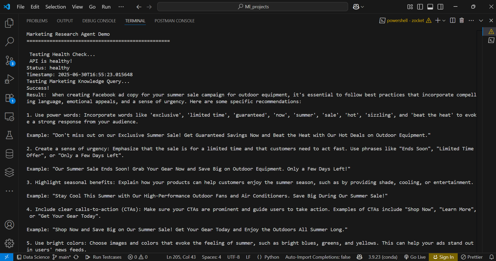
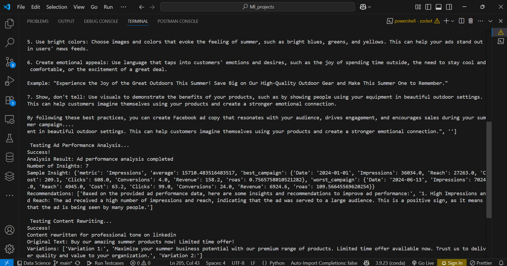

# Marketing Research Agent

A comprehensive AI-powered marketing research and optimization tool built with FastAPI and LangChain. This agent provides intelligent insights for ad performance analysis, content rewriting, and marketing knowledge queries using RAG (Retrieval-Augmented Generation).

## 🚀 Features

- **Marketing Knowledge Query**: RAG-powered system that answers marketing questions using a curated knowledge base
- **Ad Performance Analysis**: Analyze CSV files containing ad campaign data with AI-generated insights and recommendations
- **Content Rewriting**: Rewrite ad content for different tones and platforms (Facebook, Google, Instagram, LinkedIn)
- **RESTful API**: Clean API endpoints for easy integration
- **AI-Powered Insights**: Uses Mixtral-8x7B model for intelligent analysis and recommendations

## 📋 Requirements

- Python 3.8+
- FastAPI
- LangChain
- Pandas
- ChromaDB
- HuggingFace Transformers
- Together AI API access

## 🛠️ Installation

1. Clone the repository:
```bash
git clone <repository-url>
cd zocket
```

2. Install dependencies:
```bash
pip install -r requirements.txt
```

3. Set up environment variables:
Create a `.env` file in the root directory:
```env
TOGETHER_API_KEY=your_together_api_key_here
```


## 🚀 Usage

### Starting the Server

Run the FastAPI server:
```bash
python backend.py
```

The API will be available at `http://localhost:8000`

### API Documentation

Visit `http://localhost:8000/docs` for interactive API documentation (Swagger UI).

### Running the Demo

Execute the demo script to test all functionality:
```bash
python demo_notebook.py
```

## 📊 API Endpoints

### 1. Marketing Knowledge Query
**POST** `/run-agent`

Query the marketing knowledge base with RAG.

```json
{
  "query": "What are the best practices for Facebook ad copy?",
  "context": "Summer campaign for outdoor equipment"
}
```

### 2. Ad Performance Analysis
**POST** `/analyze-performance`

Upload a CSV file with ad performance data for AI analysis.

**Form Data:**
- `file`: CSV file with campaign data
- `query_type`: Type of analysis ("insights", "recommendations")

**Expected CSV columns:**
- `campaign_name`, `impressions`, `clicks`, `conversions`, `cost`, `ctr`, `cpc`, `roas`

### 3. Content Rewriting
**POST** `/rewrite-content`

Rewrite ad content for different tones and platforms.

```json
{
  "text": "Buy our amazing products now!",
  "tone": "professional",
  "platform": "linkedin"
}
```

**Available tones:** `professional`, `fun`, `casual`, `urgent`  
**Available platforms:** `facebook`, `google`, `instagram`, `linkedin`, `general`

### 4. Health Check
**GET** `/health`

Check API health status.

## 📁 File Structure

```
zocket/
├── backend.py                 # FastAPI application with agent logic
├── demo_notebook.py                 # Demo script for testing functionality
├── .env                    # Environment variables (create this)
├── requirements.txt        # Python dependencies
└── README.md              # This file
```

## Results 

<p float="left">
  
  
</p>

## 🔧 Configuration

The agent uses several configurable components:

- **LLM Model**: Mixtral-8x7B-Instruct-v0.1 via Together AI
- **Embeddings**: sentence-transformers/all-MiniLM-L6-v2
- **Vector Store**: ChromaDB for similarity search
- **Memory**: Conversation buffer for context retention


## 🧪 Testing

The demo script includes comprehensive tests:

1. **Health Check**: Verify API connectivity
2. **Marketing Query**: Test knowledge base queries
3. **Performance Analysis**: Test CSV file analysis
4. **Content Rewriting**: Test content optimization


## 🔍 Features in Detail

### Marketing Knowledge Base
Pre-loaded with marketing best practices covering:
- Platform-specific advertising guidelines
- Creative optimization strategies
- Performance marketing insights
- Campaign timing and seasonality tips

### AI-Powered Analysis
- Automatic metric calculation (ROAS, CTR, CPC)
- Performance benchmarking
- Campaign comparison insights
- Actionable recommendations

### Content Optimization
- Platform-specific adaptations
- Tone-based rewriting
- Multiple variation generation
- CTA and messaging optimization


